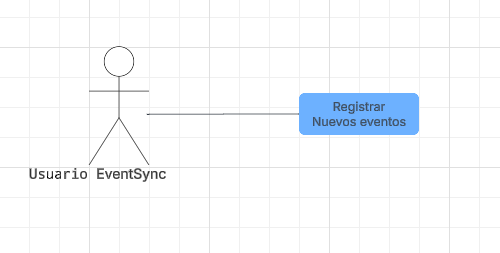
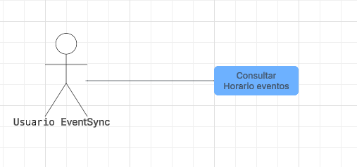

# 📄 Requerimientos del Sistema

### Requerimiento Funcional 1

| Campo | Descripción |
|------|-------------|
| **ID** | RF-01 |
| **Nombre del requerimiento** | Crear eventos segun su tipo |
| **Descripción** | *El sistema debe tener la capacidad de que los usuarios en base a que tipo de usuarios son creen eventos segun el tipo de eventos disponibles* |
| **Precondiciones** | *Para que el sistema cumpla con este requerimiento, EventSync debe tener previamente un sistema externo que le permita verificar el tipo de usuario* |
| **Actor** | *Usuario de EventSync* |
| **Flujo principal** | 1. El actor ingresa el tipo de evento 2. Ingresa un titulo  3. Ingresa la duracion  4. Ingresa la fecha  5. Ingresa el cupo 6. EventSync confirma o cancela la creacion del evento|
| **Diagrama de caso de uso** ||
| **Poscondiciones** | *Se espera como resultado que en la aplicacion de EventSync queden registrados correctamente los eventos creados* |

### Requerimiento Funcional 2

| Campo | Descripción |
|------|-------------|
| **ID** | RF-02 |
| **Nombre del requerimiento** | Notificiacion de cambios a los inscritos |
| **Descripción** | *El sistema debe mostrar al ususario en la pagina principal los eventos a los que esta inscrito fecha y hora de estas y avisar si han sido cambiadas con un color rojo* |
| **Precondiciones** | *Para que el sistema cumpla con este requerimiento, Bankify debe tener previamente la funcion de creacion de eventos e inscripcion de eventos funcionando* |
| **Actor** | *Usuario de EventSync* |
| **Flujo principal** | 1. El actor entra a ver los eventos a los que se inscribio 2. El sistema muestra los eventos y sus fechas 3. El sistema muestra los cambios de horario |
| **Diagrama de caso de uso** |  |
| **Poscondiciones** | *Se espera como resultado que los usuarios inscritos esten bien informados de los posibles cambios a los que se vea realizado un evento* |

